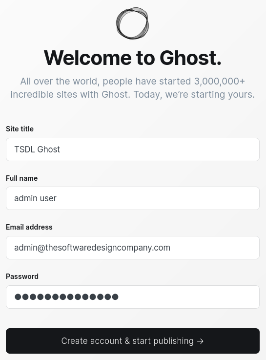
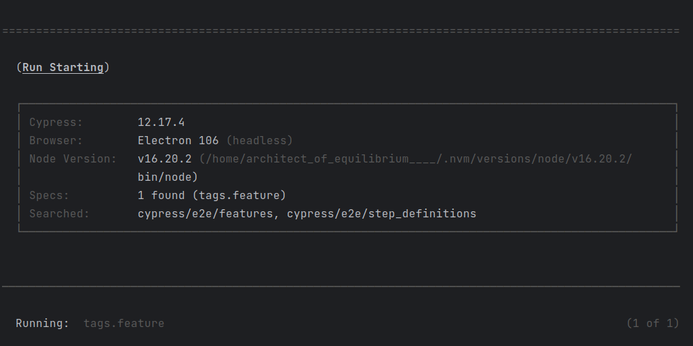
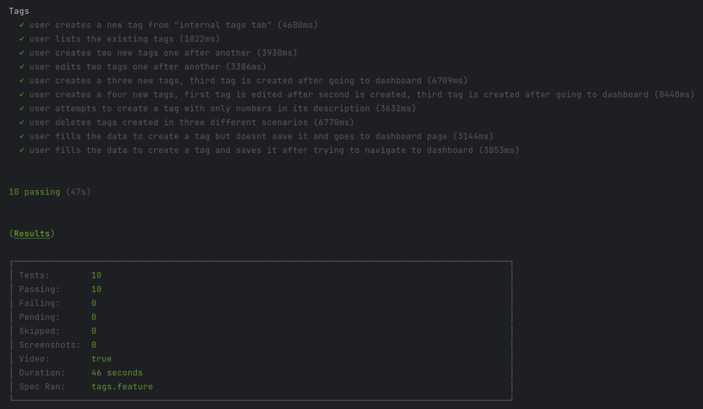
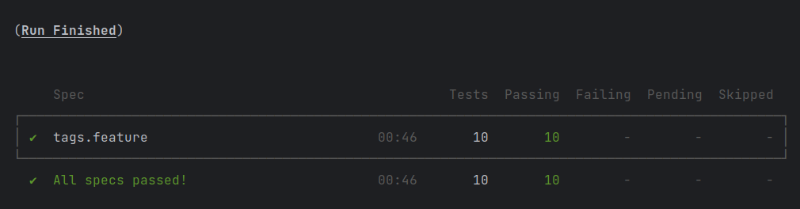

# MISO-4103-Semana-8 - Equipo 32

Entrega para la semana 8 de MISO-4103 Automatización de Software - Equipo 32

# Integrantes

- Miguel Angel Avila Torres - ma.avilat12@uniandes.edu.co

# Comentarios

---

Decidí hacerme solo para esta entrega debido a problemas de colaboracion y comunicacion con los
miembros de mi equipo anterior.

Dialogando con la estimada monitora Alejandra Sabogal, ella me ha indicado que al hacerme solo tendre que
entregar el equivalente al trabajo de una sola persona (una cuarta parte de la carga), por lo tanto,
espero que el monitor que tome la nota de la presente entrega, tenga en cuenta este hecho.
Sin embargo, para mostrar compromiso con la materia y debido al desempeño en la entrega de la semana 7,
aspiro a cubrir todos los puntos de esta entrega de la mejor manera.
(un compañero y yo trabajamos sin saber de los otros dos integrantes).

De antemano, muchas gracias por el tiempo que el revisor dedica a revisar la entrega.

---

Adicionalmente, ya que se solicita codigo fuente ejecutable, he realizado pruebas E2E como se describe en
la **plantilla estrategia de pruebas** para que estas sean ejecutadas.

Finalmente, he de mencionar que he decidido trabajar con una version de GHOST que en el grupo no habíamos
tocado antes, GHOST 5.70. Para que la entrega se diferencie mejor.

---

# Entregables en el repositorio

- Estrategia de pruebas - En la carpeta `./documentos-entregables`
- Inventario de pruebas exploratorias - En la carpeta `./documentos-entregables`
- Resultados de la estrategia para la semana 1 - En la carpeta `./cypress-e2e`
- Reporte de incidencias - Issues en este repositorio

- En la wiki se encuentran:
    - Link al video de youtube donde se detallan los elementos requeridos en la rúbrica.
    - Análisis de los pros/contras de las herramientas usadas
    - Limitaciones, costos adicionales al presupuesto, ventajas, y
      desventajas del proceso de pruebas propuesto para las 8 semanas.

# Instrucciones para ejecutar los casos de pruebas E2E

## Ejecutar GHOST 5.70 en un docker container

Se ha de traer ghost arriba con el siguiente comando

```bash
# cuidado con el primer comando, remueve los contenedores preexistentes.
docker rm -f $(docker ps -qa)
docker run -d --name ghost -e NODE_ENV=development -e url=http://localhost:2368 -p 2368:2368 ghost:5.70
```

### Credenciales a ingresar antes de ejecutar las pruebas E2E

Antes de ejecutar las pruebas, es necesario que se ingresen la siguiente información:

<table style="width: 100%">
<thead>
  <tr>
    <th>site title</th>
    <th>full name</th>
    <th>email</th>
    <th>password</th>
  </tr>
</thead>
<tbody>
  <tr>
    <td> TSDL Ghost </td>
    <td> admin user </td>
    <td> admin@thesoftwaredesigncompany.com </td>
    <td> Contraseña123# </td>
  </tr>
</tbody>
</table>

### Ejemplo de llenado de credenciales
<div align="center">
  
</div>

## Instalar dependencias de nodejs para Cypress

El primer paso que debemos dar para ejecutar los tests de `cypress` es instalar sus dependencias.
Desde la raíz del proyecto de cypress (`./cypress-e2e`) debemos ejecutar los siguientes comandos,
en el orden en el que se muestran.

```bash
cd cypress-e2e   # Ingresamos al directorio donde esta el proyecto de Cypress
npm install      # Instalamos las dependencias
```

## Ejecutar cypress

- Es un prerrequisito tener GHOST "arriba" y con las credenciales que se indican.

Luego de instaladas las dependencias y dentro de la carpeta `./cypress-e2e`,
procedemos a ejecutar las pruebas con el siguiente comando.

```bash
# recomendado para que no aparezcan advertencias de cypress
npx cypress run --spec cypress/e2e/features,cypress/e2e/step_definitions

# u opcionalmente
npx cypress run --spec cypress/e2e/*
```

La ejecución de los tests ha de mostrar una salida **similar** en consola:

<div>
  
</div>

<div>
  
</div>

<div>
  
</div>

#### Bueno, eso ha sido todo.
